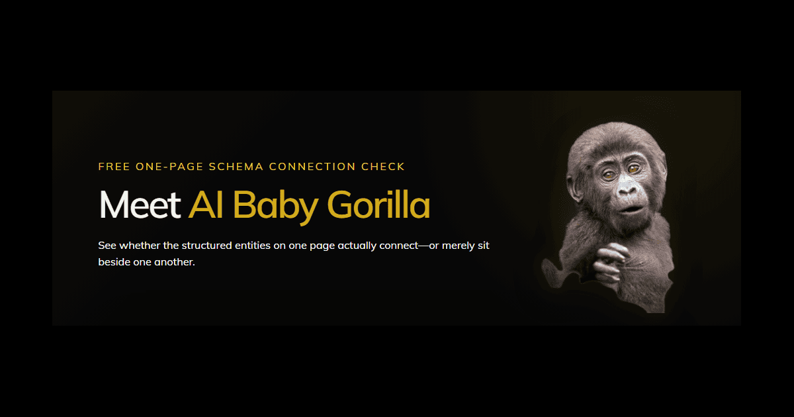

# AI Baby Gorilla

**Free one-page JSON-LD entity connection and minimum identity checker**

AI Baby Gorilla is a public diagnostic tool developed by Sydney Business Web. It examines the structured entities described on one public webpage and determines whether they form a coherent, connected machine-readable identity.

Live tool:  
https://sydneybusinessweb.com.au/ai-baby-gorilla/

## The problem it examines

A webpage can contain technically valid JSON-LD while still presenting disconnected, duplicated or incomplete entities.

Conventional validators are useful for checking syntax and supported properties. AI Baby Gorilla asks a different question:

> Do the structured entities on this page actually connect into a coherent identity graph?

For a homepage, it also examines whether the minimum business identity route is present:

**Homepage → WebSite → Business**

## What the system examines

At a high level, AI Baby Gorilla:

1. retrieves one publicly accessible webpage;
2. extracts its JSON-LD blocks;
3. identifies the entities and named relationships;
4. resolves repeated and referenced `@id` values;
5. examines connected and isolated graph components;
6. checks minimum homepage identity anchors where applicable; and
7. explains the result, likely effect and appropriate next steps.

The system distinguishes graph connectivity from identity completeness. A graph may be connected while still lacking important homepage identity anchors.

## Result classifications

AI Baby Gorilla may classify a page as:

- **Connected** — the principal entities form one coherent on-page graph;
- **Partly connected** — useful relationships exist, but important entities remain separated;
- **Fragmented** — competing or disconnected identity groups are present;
- **Isolated** — important entities exist without meaningful connections;
- **No JSON-LD** — no JSON-LD structured data was detected; or
- **Invalid JSON-LD** — structured data was present but could not be parsed safely.

Additional findings may identify missing canonical identifiers, unresolved same-site references, conflicting entity definitions or incomplete homepage identity structure.

## Scope and boundaries

AI Baby Gorilla is deliberately limited to one public webpage per assessment.

It does not:

- guarantee that a business will be mentioned, cited or recommended by an AI system;
- replace Schema.org syntax validation or Google rich-result testing;
- determine what an external search or AI platform will index, retain or display;
- prove that all pages across a website use the same identities; or
- replace a professional whole-site entity analysis.

AI Baby Gorilla is the junior one-page companion to **Schema Gorilla**, Sydney Business Web’s comprehensive whole-site structured identity analysis.

## Access

The public checker requires no login, email address or telephone number.

Automated abuse controls and bounded retrieval safeguards are used to protect the service and prevent the checker from being used as an unrestricted fetching mechanism.

## Current release

**Version:** 0.3.0  
**Release date:** 3 September 2026  
**Developer:** Sydney Business Web  
**Principal designer:** Keith Rowley

## Related Sydney Business Web systems

- **Schema Gorilla** — whole-site structured identity and entity-graph analysis
- **AI Observatory** — verified AI retrieval monitoring
- **AI Identity Diagnostic** — professional evidence-led diagnosis and remediation planning
- **Intelligent Entity Skeleton** — coherent machine-readable business identity framework
- **AI Credibility Footprint** — corroborating digital evidence framework

More information:  
https://sydneybusinessweb.com.au/ai-visibility-tools/

## Repository purpose

This public repository provides system-level documentation, version history and an enduring authorship record for AI Baby Gorilla.

The production source code, security controls, infrastructure configuration, assessment logic and operational implementation are proprietary and are not included.

## Copyright and rights

Copyright © 2026 Sydney Business Web. All rights reserved.

AI Baby Gorilla, Schema Gorilla, AI Observatory, AI Identity Diagnostic, Intelligent Entity Skeleton and AI Credibility Footprint are proprietary software systems, analysis technologies, services and frameworks developed by Sydney Business Web.

Publication of this documentation does not grant permission to copy, reproduce, reverse engineer, commercially exploit or create derivative implementations of the proprietary system.

Sydney Business Web™ and its logo™ are trademarks of Sydney Business Web, TM Number 2570197.